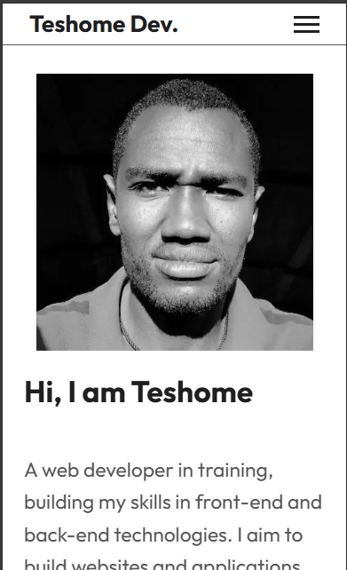
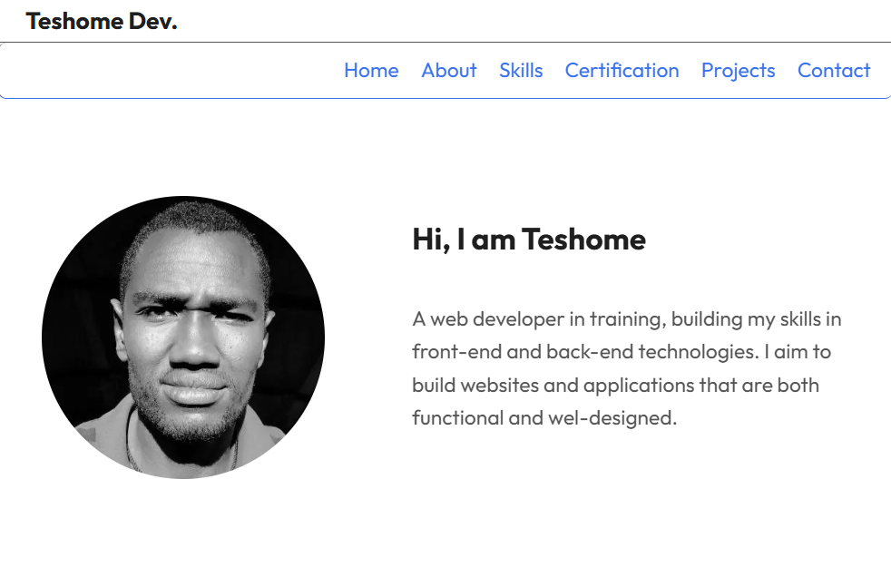
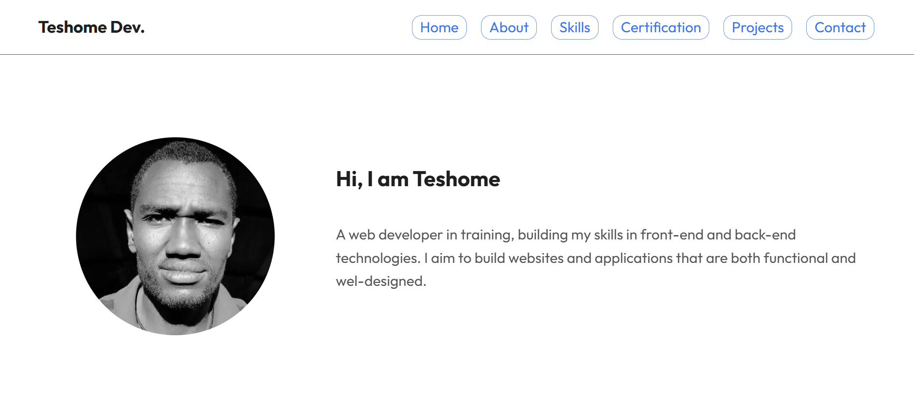

# My Portfolio Website

A responsive personal portfolio website built with **HTML, CSS, and JavaScript**.
It showcases my skills, projects, and certifications as I grow as a web developer.

## Live Demo

https://teshomedev.github.io/my-portfolio/

## Features

* Responsive design for mobile, tablet, and desktop
* Mobile navigation menu
* Projects showcase
* Certifications carousel
* Contact form

## Technologies Used

* HTML5
* CSS3
* JavaScript
* GitHub Pages (deployment)

## Screenshot

## Author

Teshome Bekele
